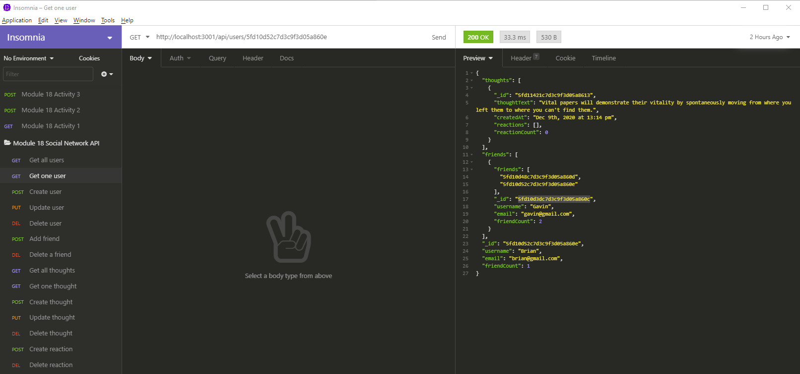

# NoSQL Social API

  
  
  
  


## Project Description

This project creates an API for a fictional social networking application, allowing users to share thoughts, have friend lists, and react to friends' thoughts. Users can also update a thought, delete a thought, delete a reaction, remove a friend, and delete their account, removing their associated thoughts and removing them from any friend lists they were on.

## Tools Used to Create This Project
* JavaScript
* Node.js
* Express.js
* MongoDB
* Mongoose

## Installation and Usage

If you would like to view the code and use the API on your own computer, follow the steps below:

* Clone the repository to your computer
* From the project directory command line, type `npm install` to install the dependencies for this project (express, and mongoose)
* Type `npm start` to start the server
* When you see the notification that the server is connected on localhost:3001, you can open your tool of choice to test out the routes. I used Insomnia Core.
* The routes are as follows:
    * Get all users: GET http://localhost:3001/api/users/
    * Get one user: GET http://localhost:3001/api/users/:userid
    * Create a user: POST http://localhost:3001/api/users/
    * Update a user: PUT http://localhost:3001/api/users/:userid
    * Delete a user: DELETE http://localhost:3001/api/users/:userid
    * Add a friend: POST http://localhost:3001/api/users/:userid/friends/:userid_of_friend
    * Delete a friend: DELETE http://localhost:3001/api/users/:userid/friends/:userid_of_friend
    * Get all thoughts: GET http://localhost:3001/api/thoughts/
    * Get one thought: GET http://localhost:3001/api/thoughts/:thoughtid
    * Create a thought: POST http://localhost:3001/api/thoughts/
    * Update a thought: PUT http://localhost:3001/api/thoughts/:thoughtid
    * Delete a thought: DELETE http://localhost:3001/api/thoughts/:thoughtid
    * Create a reaction: POST http://localhost:3001/api/thoughts/:thoughtid/reactions
    * Delete a reaction: DELETE http://localhost:3001/api/thoughts/:thoughtid/reactions/:reactionid

* To create a user, the JSON body should be of the form
```
{
  "username": "Gavin",
  "email": "gavin@gmail.com"
}
```
* To create a thought, the JSON body should be of the form
```
{
  "thoughtText": "Here's a cool thought...nitrogen turns from a gas into a liquid at -320 degrees F (-196 degrees C).",
  "username": "Gavin",
  "userId": "5fd10d3dc7d3c9f3d05a860c"
}
```
     * Where the userId is the one generated by your MongoDB instance

* A a reaction JSON body will appear as follows
```
{
  "reactionBody": "It's never too cold for iced coffee",
  "username": "Brian"
}
```


## Screenshot



## Walkthrough Video
A walkthrough video of the API routes can be found [at this link](https://drive.google.com/file/d/1t5EAA9HISZJhPTWqLo6F15WVGXaRY421/view)

## License
  **Licensed under the MIT License.**

 MIT License

Copyright (c) 2020 Week In View

Permission is hereby granted, free of charge, to any person obtaining a copy
of this software and associated documentation files (the "Software"), to deal
in the Software without restriction, including without limitation the rights
to use, copy, modify, merge, publish, distribute, sublicense, and/or sell
copies of the Software, and to permit persons to whom the Software is
furnished to do so, subject to the following conditions:

The above copyright notice and this permission notice shall be included in all
copies or substantial portions of the Software.

THE SOFTWARE IS PROVIDED "AS IS", WITHOUT WARRANTY OF ANY KIND, EXPRESS OR
IMPLIED, INCLUDING BUT NOT LIMITED TO THE WARRANTIES OF MERCHANTABILITY,
FITNESS FOR A PARTICULAR PURPOSE AND NONINFRINGEMENT. IN NO EVENT SHALL THE
AUTHORS OR COPYRIGHT HOLDERS BE LIABLE FOR ANY CLAIM, DAMAGES OR OTHER
LIABILITY, WHETHER IN AN ACTION OF CONTRACT, TORT OR OTHERWISE, ARISING FROM,
OUT OF OR IN CONNECTION WITH THE SOFTWARE OR THE USE OR OTHER DEALINGS IN THE
SOFTWARE.
